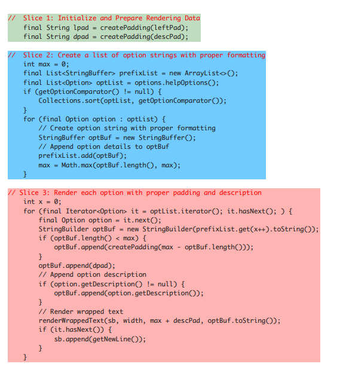
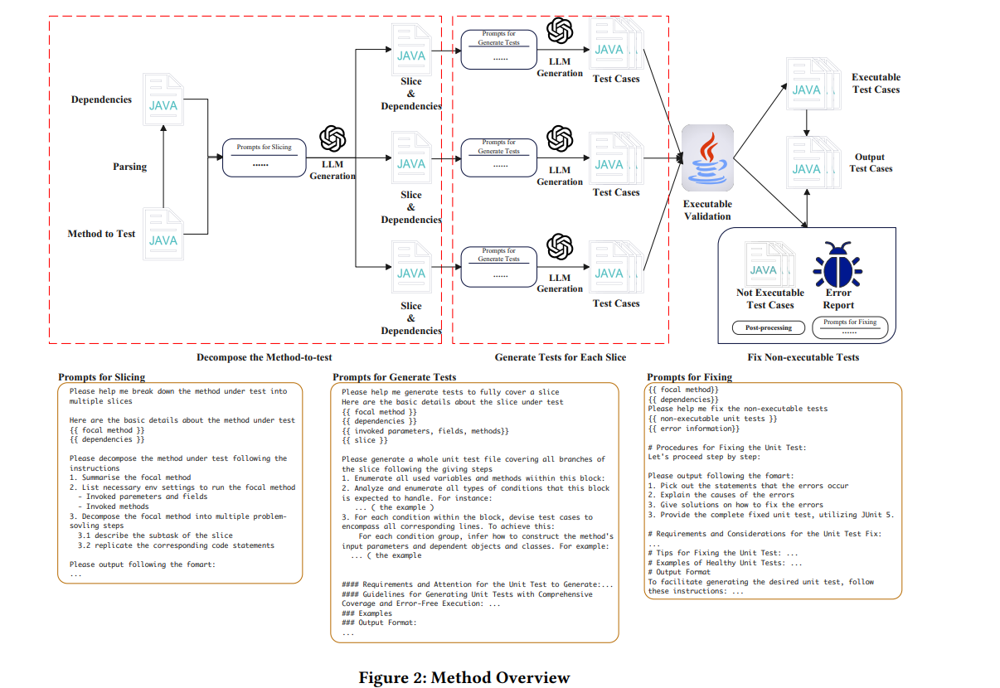
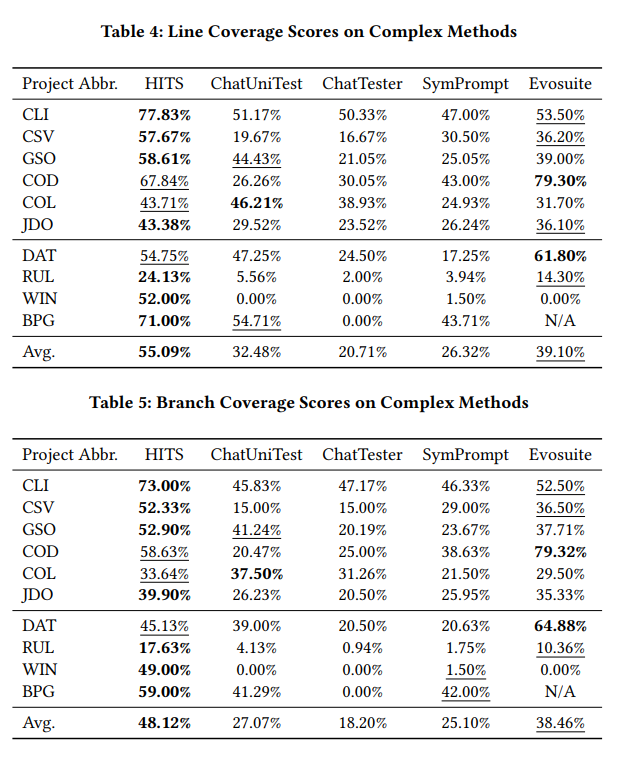

# HITS: High-coverage LLM-based Unit Test Generation via Method Slicing
https://arxiv.org/pdf/2408.11324

## Overview
LLMs have struggled with creating tests for complex focal methods (method under test).  This complexity causes the LLM to miss lines and branches when generating tests.  In order to fix this issue, the paper proposes decomposing the focal methods into slices, and ask the LLM to generate tests slice-by-slice.

> Complex methods are functions with cyclomatic complexity greater than 10

## Background
When testing ChatUniTest, an LLM-based unit test generator, it shows evidence that current implementations have significantly lower line and branch coverage when testing complex methods.

In order to solve this, the paper proposes the divide-and-conquer algorithm by slicing the complex methods and creating tests individually.  

### Code Slice
A code slice is successive statements describing a solution step.  The LLM additionally does not have to consider all the concrete execution paths in the previous slices.  To reach a branch in the slice under test, only one feasible execution path through the previously analysed slices is enough.

These slices are decomposed using ChatGPT and revised by a human engineer.

## Methology
1. The method under tests dependencies are retrieved via static analysis.
    - Dependent classes fields
    - Method declarations
    - Bodies of methods invoked by the focal method
2. Using chain-of-though the LLM performs method decomposition.
    - Each slice is a step for solving a problem.
3. Using this decomposed method the LLM performs test generation.

### Broken Tests
Additionally, for tests that fail to execute, they use "self-debug" to fix them.
> Self debug: https://openreview.net/forum?id=KuPixIqPiq

The LLM is provided with the broken test and the error report from the JVM.  Then it receives a plan to fix the failed test step-by-step
1. Summarize the cause of the error.
2. Describe how to alleviate the cause in natural language.
3. Generated fixed version of the test.

Additionally, common causes of compliation/execution failures are provided as few-shot examples.

Some common errors that are provided as few-shot examples are as follows:
- The basic structure of an executable JUnit 5 test suite
- The usage of reflection to handle private/protected Java code elements
- The strategy handling focal methods related to inner classes.
- The usage of the Mockito library.

### Post-processing of LLM Generation
- Format: The CoT elements are written in markdown where the output is written in JSON
- Test Case Identification and Isolation: The LLM output is split into individual test files via pattern matching and code transformation.
- Rule-based Fixing: Three rule-based fixing methods are applied.
    - Brackets balancing via pattern matching
    - Removing unnecessary validation
    - Importing commonly used packages

## Results
The results show that HITS has higher line and branch coverage scores than other LLM unit test generator competitors.  This shows that the slicing approach causes significant increase in coverage.

