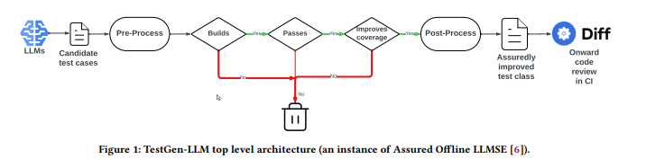
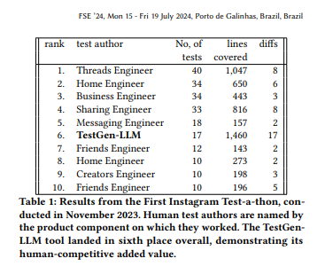
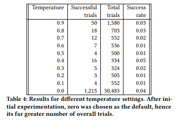
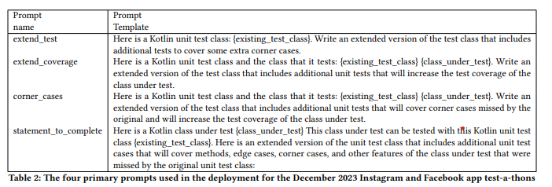

# Automated Unit Test Improvement using Large Language Models at Meta

## Overview
In 2024, Meta created a tool named TestGen-LLM.  This tool used LLMs to **improve** existing human-written tests.  This tool was intended to support humans, rather than replace them.

By setting several filters including a human-in-the-loop check, measurable improvement over the original test suite was able to be confirmed, eliminating LLM hallucination issues.

## Background

### LLMs used
The LLMs used for TestGen-LLM were two models constructed internally at Meta.  Details were not given about the models within the paper.

### Existing Test Classes
The existing test classes consisted of human-written Kotlin test classes.

### Assured Offline LLM-Based Software Engineering
The full explanation of this is out-of-scope for this report, however, in brief it is a generate-and-test approach.  It applies a series of semantic filters that discard code that fails to meet the two requirements below:

1. It does not regress the properties of the original code.
2. It improves the original in a verifiable and measurable way.

This helps to overcome the issue of hallucination in LLMs.

[Research Paper](https://arxiv.org/pdf/2402.09171)

### Use Cases

#### 1: Evaluation
By switching LLMs, prompting strategies, and parameters, the user can see what effects they have to existing code easily.

#### 2: Deployment
By using LLMs TestGen-LLM can automate test class improvement.  This improvement is backed by:
1. Detailed automatically-generated documentation that measures the improvement achieved by the new version of the test class.
2. Verifiable guarantees that the recommended test class does not regress any of the important properies of the existing version of the test class.

## TestGen-LLM's System

The system achieves the level of assurance due to the filters shown above.  The filters work in the following order:

### Compile
If the generated code is fully buildable within the app.  On failure, the code is immediately discarded.

### Execute
The generated test is then executed, any test that does not pass is discarded.  The reason being is that we cannot know if the test is failing due to an incorrect assertion or due to finding an existing bug in the code base.

In order to prevent flakey tests, TestGen-LLM uses repeated execution (5 times) and any test that does not pass all 5 times is deemed flakey and discarded.

### Improves Coverage
A generated test that passes the first two filters will prove useful for regression testing, however, it may repeat the test behavior of an existing test, therefore by measuring the level of coverage, TestGen-LLM proves that the test suite has been improved in a meaningful way.

## Deployment

### Initial Trial
The initial trials created eight diffs (PRs) and submitted them into Metas CI code review system.  From this trial there were two major takeaways.

#### The Importance of Individual Test Level Guarantees
Originally, the third filter, improves coverage, only checked class level coverage.  However, in the event that multiple test cases are added in the same PR, the added test cases may not **all** increase coverage.  

Therefore, the coverage increase must be measured per test class rather than class.

#### More Coverage Details Useful
The original MVP only reported the files which the improvement suggestion achieved extra coverage.  The reviewers of the PRs wanted a full coverage report for each file compared to the original.

--- 
### November Instagram Test-a-thon
This is a multi-day event in which human engineers write test cases. 36 engineers spent a significant portion of their daily work focused on writing additional test cases for specific Instagram products targeted by the test-a-thon.  These test classes and products had recently been intensively refactored.

#### Results
TestGen-LLM created 17 PRs, 16 of which went into production. The results of the test-a-thon are shown in the table below.

A caveat to the data shown is that, while it looks like TestGen-LLM covered many more lines compared to its ranking, this mostly came from one test case which covered 1326 lines.

### Evaluation of the LLMs and Prompts
Due to the results of the test-a-thon, confidence in the tools usability increased.  It added valid edge cases and the overall performance relative to the human effort provided evidence that the tool was worth developing further.

Experiments were undertaken to determine the best temperature, LLM, and prompts.  

#### Temperature
Temperature set to 0 had the highest rate of success.

#### Prompts
`extend_coverage` is the canonical example, which gives maximal information and clear direction to the language model.
- LLM1: Added 2 unique tests
- LLM2: Added 5 unique tests

`corner_cases` is specifically to focus on corner cases.
- LLM1: Added 1 unique test
- LLM2: Added 1 unique test

`extend_test` is to investigate the potential to find solutions when only the test class is provided.
- LLM1: Added 1 unique test
- LLM2: Added 2 unique tests

`statement_to_complete` is to investigate the alternative prompting style of making a statement that should be completed by the language model.
- LLM1: Added 0 unique tests
- LLM2: Added 2 unique tests

Overall, `extend_coverage` using LLM2 with a temperature of 0 was the most effective settings.

---

### December Instagram Test-a-thon
TestGen-LLM was deployed at the December test-a-thon.  Over 50% of the PRs submitted by TestGen-LLM were accepted by engineers, compared to a 70% acceptance rate when created by engineers.

Out of 280 PRs:
- 144 were accepted by the reviewer
- 64 were rejected
- 61 did not recieve a review
- 11 were withdrawn

## Quantitative Results from Deployment
- 196 Test Classes were successfully improved
- The tool was applied to 1979 test classes.
- Therefore the tool was able to automatically improve roughly 10% of test classes to which it was applied.
- 73% of test improvements were accepted by developers.

## Qualitative Observations from Deployment

### LLM 'Self-plagiarism'
Due to the temperature setting, along with the nature of LLMs, when responding to the same prompt, the LLM often would create the same tests.  

It was reported that tests generated would almost be exactly the same as previously generated tests or completely different.  This created an "all-or-nothing" situation with newly generated tests.

### Nuanced Coverage Reporting
The generated tests would sometimes (due to insufficient mocking) work more similarly to integration tests.  By adding more nuanced coverage reporting to the tool, it could more easily flag this issue to code reviewers.

### Highlighting Test Need
Even when the test was not successfully created, or was created with a TODO, TestGen-LLM could identify areas in which there is potential for greatly increasing test coverage.
