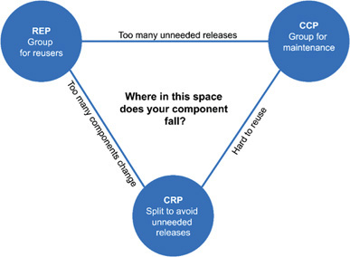

# Component Cohesion

## REP: The Reuse/Release Equivalence Principle
```
The granule of reuse is the granule of release
```
- Classes and modules that are grouped together into a component should be releaseable together.
- The fact that the classes and modules share the same version number and same release tracking should "make sense".

## CCP: The Common Closure Principle
```
Gather into components those classes that change for the same reasons and at the same times. Separate into different components those classes that change at different times and for different reasons.
```
- This is similar to the SRP except for components.
- This states that each component should not have multiple reasons to change.
- The CCP leads us to gather all the classes that are likely to change for the same reasons together.

## CRP: The Common Reuse Principle
```
Don't force users of a component to depend on things they don't need.
```
- This states that the classes and modules that tend to be reused together belong in the same component.
- When we depend on a component, we want to make sure that we depend on every class in that component.

## The Tension Diagram for Component Cohesion
- The REP and CCP are inclusive, therefore making components larger while the CRP is exclusive, making them smaller.
- The following diagram shows this tension between the principles.



## Takeaways
- These three principles are important to architecting reusable and maintainable components.  However they do come into conflict with each other, and the priority between these principles will shift during the lifetime of your project.