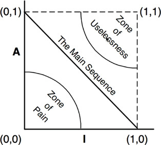

# Component Coupling

## The Acyclic Dependencies Principle
```
Allow no cycles in the component dependency graph
```

### "The Morning After Issue"
- This is an issue where you get something working, wake up the next morning, and it's no longer working because someone else has changed something.
- This becomes an issue with larger projects with many teams.
- It additionally is an issue when many devs are working on the same source files

### Using Components
- This "morning after issue" can be fixed by each team using components.  
- By releasing different versions of an isolated component, each team and work individual and not break each other's stuff.
- A major caveat with this however, is that there can be no dependency cycles.

#### The Effect of a Cycle in the Dependency Graph
- Because of a cycle, essentially all the components related by the cycle have become one big component.
- They will end up breaking each other's code in order to try to fix their own.

### Top-Down Design
- The component structure cannot be designed from the top down.
- This cannot be decided at first, but it is a thing that evolves as the system grows and changes.
- Components are a map to the buildability and maintainability of the application.

## The Stable Dependencies Principle
```
Depend in the direction of stability.
```
- This principle ensures that modules that are intended to be easy to change are not depended on by modules that are harder to change.

### Stability?
- Stability in software can be measured by dependencies.
- If something is depended on by other components, it is hard to change and therefore stable
- On the other hand, if something depends on many other components, it changes often and therefore unstable.

#### Stability Metrics
- Fan-in: Incoming dependencies.  This is the number of classes outside the component that depend on classes within the component.
- Fan-out: Outgoing dependencies.   This is the number of classes inside the component that depend on classes outside the component.
- I: Instabiity (I = Fan-out, (Fan-in + Fan-out)).  This metric ranges from 0 to 1.  0 is a maximally stable component, while 1 is the opposite.

## The Stable Abstractions Principle
```
A component should be as abstract as it is stable.
```
### The Issue - Where do we put the high-level policy?
- We don't want to have high-level architectural and policy decisions to be volatile, therefore they should be in stable components.
- However, if we put this logic into stable components, the application becomes inflexible and hard to change.

### The SAP
- This principle sets up a relationship between stability and abstractness.  A stable component should be abstract so that its stability does not prevent it from being extended.
- If a component is to be stable, it should consist of interfaces and abstract classes so that it can be extended.

### Measuring Abstraction
- A is the metric for the abstractness of a component, it is the ratio of interfaces and abstract classes in a component to the total number of classes in the component.
- Nc: The number of classes
- Na: The number of abstract classes and intefaces in the component
- A: A = Na / Nc
- The metric ranges from 0 to 1.  0 is not abstract, and 1 is only abstract classes.

### The Main Sequence
- We don't want our programs to be too concrete OR too abstract, as they are either extremely painful to change or not useful at all.



- The Main Sequence is when the locus of points is maximally distant from each zone.  This line goes straight down the middle.
- The ideal position for a component is at one of the two endpoints of the Main Sequence, 0,1 or 1,0.

### Distance from the Main Sequence
D^3: Distance (D = |A + I - 1|): This metrics range is also 0 to 1.  0 indicates that the point is directly on the Main Sequence, where 1 indicates it is as far as possible from the Main Sequence.