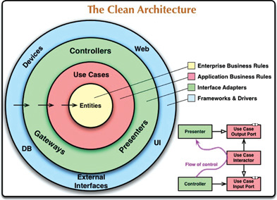

# The Clean Architecture
- Generally most modern architectures have a similar objective, separation of concerns.
- They are:
    - Independent of frameworks
    - Testable
    - Independent of the UI
    - Independent of the database
    - Independent of external agency

The further in you go, the higher level the software becomes.

## The Dependency Rule
> Source code dependencies must only point inward, toward higher-level policies.

- Nothing in an inner circle can know anything about something in an outer circle.
    - Particularly, the name of something declared in an outer circle must not be mentioned by the code in an inner circle.
        - ex: Functions
        - classes
        - variables

## Entities
- These encapsulate "Critical Business Rules".
- It can be an object with methods, a set of data structures and functions, etc
- The main point is that the entity can be used by many different applications within the enterprise
- These are the least likely to change when something external changes

## Use Cases
- This layer contains **application specific** business rules.
- They encapsulate and implements things like the flow of data to and from the entities.
- Changes in this layer should not affect the entities.
- However, if the operation of the application changes, we should expect this layer to be affected.

## Interface Adapters
- This is a set of adapters that convert data from the format most convinient for the use cases and entities to the format most convinient for some external agency such as the database or the web.
- The presenters, views, and controllers all belong in this layer.
- Additionally, data should be converted for the database in this layer.

## Frameworks and Drivers
- This is the outermost layer of the model.
- We don't write much code here, just enough to move data to the next layer.

## What Data Crosses Boundaries?
- The data that crosses the boundaries tend to be simple data structures (structs/DTOs/arguments in function calls/etc...)
- Do NOT pass Entity objects or database rows, as this would violate the Dependency Rule.

## Takeaways
- This chapter explains the basis of Clean Architecture, where all dependencies go from low-level to high-level.
- It explains the 4 (could be more) different layers in which the code is structured.