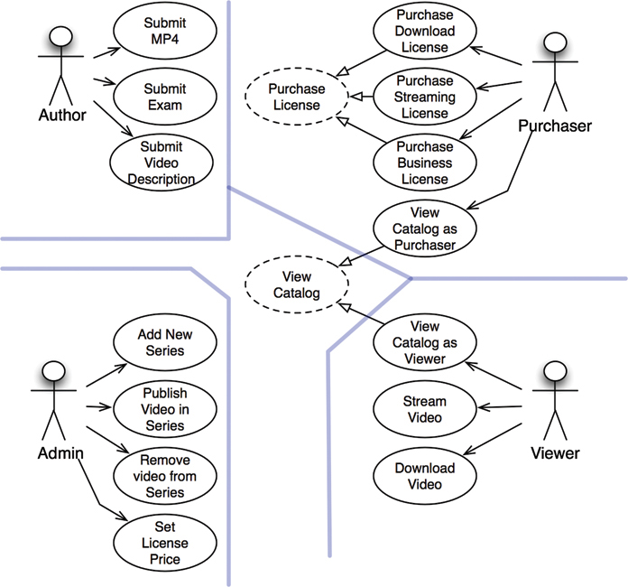
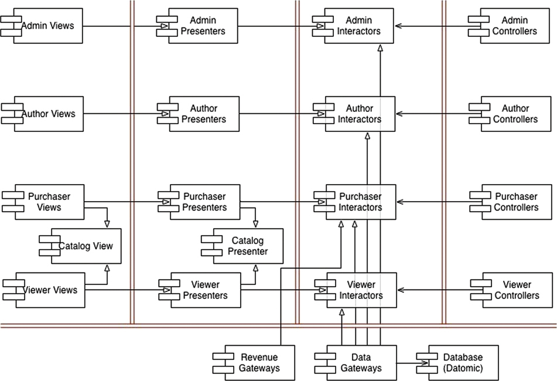

# Case Study: Video Sales

## The Case
```
- We want to sell videos.  
- We sell them online to individuals and businesses.  
- Individuals can either stream, or purchase a video for a higher price.  
- Businesses may only stream, however, they are purchased in batches that allow quantity discounts.
- Video authors need to supply their video files, descriptions, files with exams, problem solutions, source code, etc...
- Admins need to add new video series, add and delete videos to and from the series, establish prices for various licenses.
```



## Component Architecture


