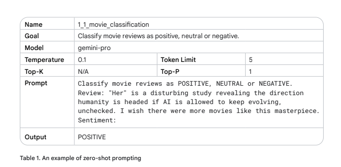
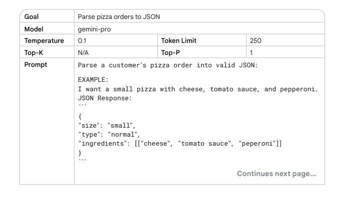
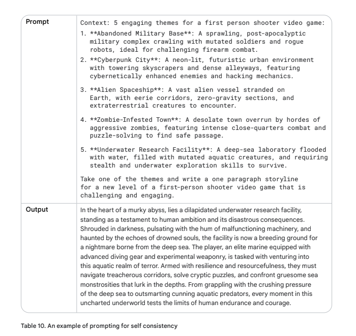
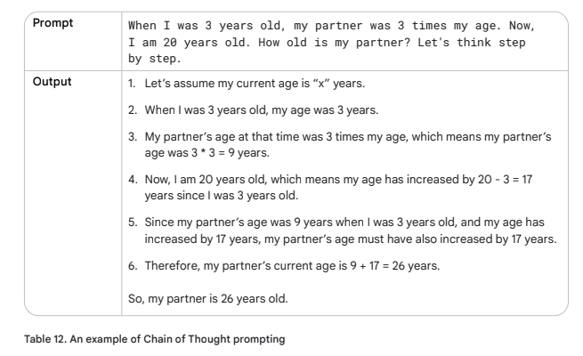
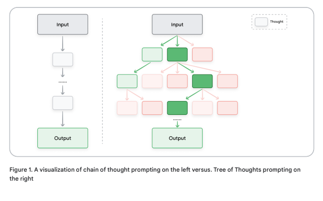
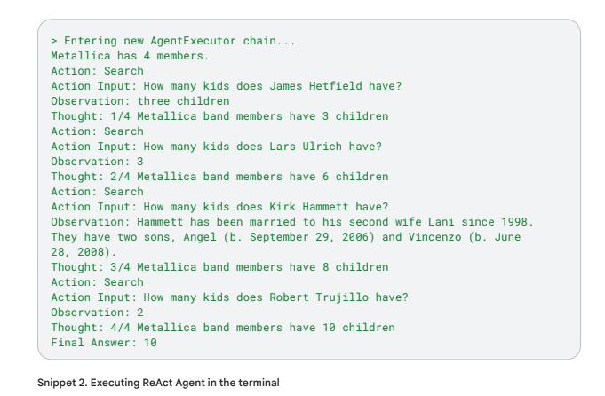

# Prompting Techniques

## General Prompting

### Zero Shot
This is the simplest type of prompt.  It gives a description of a task and some text for the LLM to get started with.  Zero shot stands for "no examples".

### One-shot & Few-shot
When creating prompts for AI models, it is helpful to provide examples.  They examples help the model understand what you are trying to generate, especially if you want to steer the model to a certain output structure or pattern.

- One-shot Prompt: Provides a single example.  The model has an example it can imitate to best complete the task.
- Few-shot prompt: Provides multiple examples.  It's similar to one-shot however, with multiple examples the chance the model follows the pattern increases.

The number of examples depends on the following:
- Complexity of the task
- Quality of the examples
- Capabilities of the LLM

For few-shot prompting, 3-5 examples is a good general rule.

## System, Contextual and Role Prompting
These are all techniques used to guide how LLMs generate text.

### System Prompting
This sets the overall context and purpose for the language model.  It's the "big picture" about what the model is doing.

It can be useful for generating output that meets specific requirements.  It can be seen as "system prompt" = "providing an additional task to the system".  It can be used for things like responding with a certain programming language, or in a certain tone.

### Contextual Prompting
This provides details or background information relevent to the current conversation or task.  This allows the LLM to better understand your request and generate more accurate responses.

### Role Prompting
This assigns a character or identity for the language model to adopt.  By assigning a role to the AI, it will give you the response in a different tone or even give you completely different answers.

## Step-back Prompting
This improves the performance by prompting the LLM with a general question related to the task at hand, then feeding the answer to that general question into another prompt for the specific task.  This allows the LLM to retrieve relevent knowledge and reasoning processes before even attempting to solve the specific problem.

In the following example, first we ask the LLM for interesting settings for a FPS stage, then putting the LLM response into context we can have the LLM generate more specific and engaging responses.

## Chain of Thought(CoT)
This is a technique for improving the reasoning capabilities of LLMs by generating intermediate reasoning steps.  Generally if a problem would be better solved by talking through the problem, CoT is a good candidate for it.

The above example is an example of zero-shot prompting, however it can also be combined with few-shot prompting in order to increase the quality and reliability of the response.

## Self-consistency
This combines sampling and majority voting to generate diverse reasoning paths and select the most consistent answer.  It improves the accuracy and coherence of responses generated by LLMs.

The steps are as follows:
1. Generating diverse reasoning paths: The LLM is provided the same prompt multiple times with a high temperature setting.  This encourages the LLM to create different reasoning paths and perspectives.
2. Extract the answer from each response.
3. Choose the most common answer.

## Tree of Thoughts (ToT)
This allows an LLM to explore multiple different reasoning paths simultaneously as seen in the image below.

ToT is well suited for complex tasks the require exploration.  

## ReAct (reason & act)
ReAct is a paradigm that allows LLMs to solve tasks by using tools and its natural language reasoning. 

Steps: 
1. ReAct combines reasoning and acting into a thought-action loops.  
2. The LLM reasons about the problem and generates a plan of action.  
3. It then performs the actions in the plan and observes the results.
4. It uses the observations to update its reasoning and generates a new plan of action.
5. Repeat until the LLM generates a solution to the problem.

## Automatic Prompt Engineering
This is a method to prompt a model to generate more prompts.  You'll evaluate them and maybe improve them manually, then repeat.