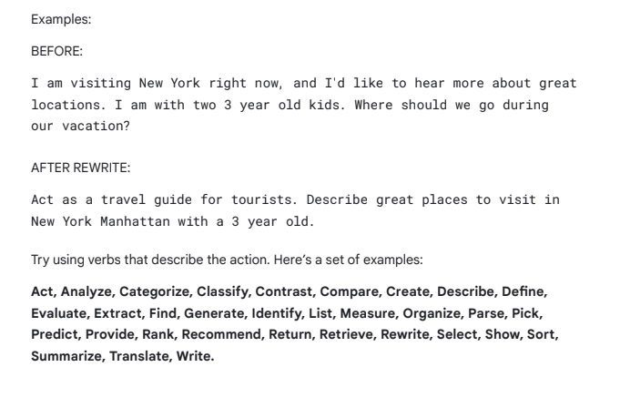
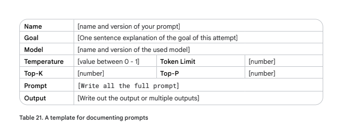

# Best Practices

## Provide Examples
It's very important to provide(one-shot/few-shot) examples within a prompt.  It gives the LLM a target and something to model its response on.

## Design with Simplicity
Prompts should be concise, clear and easy to understand for you and the model.  Generally if it's confusing for us to read as humans, it'll be confusing for the model.  Use simple language and don't provide unnecessary information.

## Be Specific About the Output
Providing details about the output format will help to increase the overall accuracy of the response.

## Use Instructions over Constraints
- Instruction: Provides explicit instructions on the format, style, or content of the response.  It tells the model what to produce.
- Constraint: A limitation or boundary on the response.  It tells the model what it should not do or avoid.

Positive instructions in prompts generally are more effective than relying heavily on constraints.  Instructions communicate what is the desired income where constraints can be unclear on what is allowed and what is not allowed.  Additionally, lists of constraints can clash with each other and cause issues.

Constraints can be valuable in certain situations where a specific output format or style is needed or to prevent harmful content from being created.

## Control the Max Token Length
Set a max token length in the configuration or request a specific length in the prompt.

## Use Variables in Prompts
By adding variables into the prompts we can both reuse and make the prompt more dynamic.

## Experiment with Input Formats and Writing Styles
Different models, prompt formats and configurations yield different results.  Therefore it's important to try out different prompts and compare the results.

## Experiment with Output Formats
For non-creative tasks consider having your response output in a structure format such as JSON or XML.

## Working with Schemas
Using things like JSON schemas in the input can give the LLM a clear blueprint of the output you want.  Additionally, JSON schemas will help to explain what each property is and help it create better responses.

## CoT Best Practices
- Putting the answer after the reasoning is required because the generation of the reasoning changes the tokens that the model gets when it predicts the final answer.
- You need to be able to extract the final answer from your prompt, separated from the reasoning.
- For CoT prompting, set the temperature to 0.

## Document the Various Prompt Attempts
Document your prompt attemps in full detail so you can learn over time what went well and what did not.

